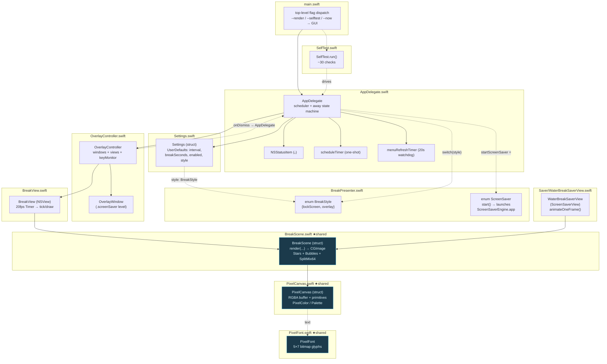
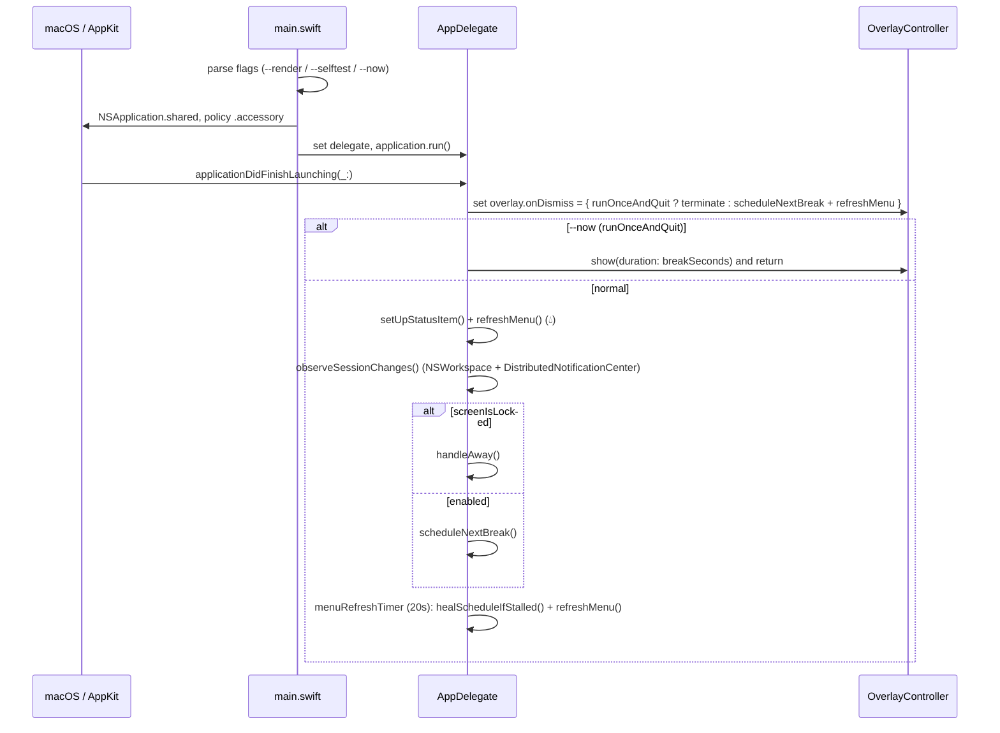
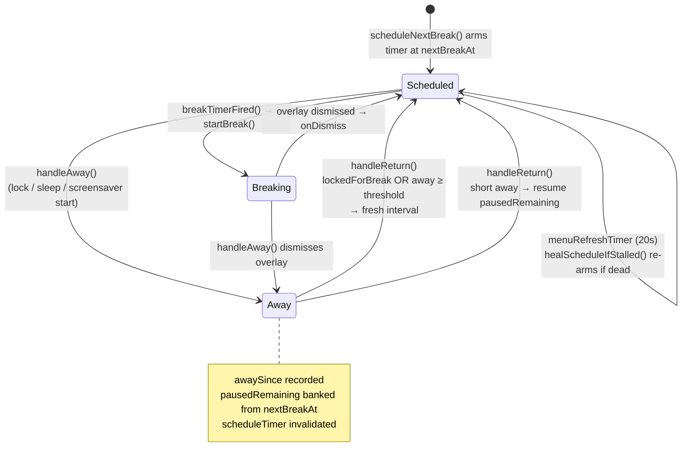
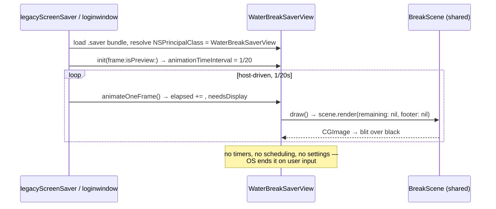

# WaterBreak — Architecture Diagrams

WaterBreak is a menu-bar macOS app (Swift/AppKit, no third-party deps) that reminds you to
take water breaks at fixed intervals by taking over every display with a procedurally-drawn
animated pixel-art scene. The scene is rendered into a small RGBA buffer (fixed 180px logical
height) and upscaled with nearest-neighbour filtering — no image assets.

The repo builds **two products** from largely shared source:

- **App target** (`WaterBreak`, SwiftPM `.executableTarget`) — the resident menu-bar scheduler.
- **Screensaver target** (`WaterBreak.saver`, loadable bundle) — a `ScreenSaverView` that draws
  the same scene on the lock screen. Built separately with `swiftc -emit-library` (SwiftPM has
  no `.saver` product type).

Central idea (see `DESIGN.md`): **time away from the machine counts as a break already taken.**

> Naming note for readers: `BreakPresenter.swift` does **not** contain a `BreakPresenter` type —
> it holds `enum BreakStyle` and `enum ScreenSaver`.

---

## 1. Component & ownership graph

Solid arrows = "owns / holds a reference"; dashed = "reads from / uses". Files shared between
the two build products are highlighted.



The **★shared** files (`BreakScene`, `PixelCanvas`, `PixelFont`) are compiled into *both* the
app and the screensaver (see `build-saver.sh` `SHARED_SOURCES`) — not copied. The saver uses
**none** of `AppDelegate`, `OverlayController`, `BreakView`, `Settings`, or `BreakPresenter`.

---

## 2. App launch sequence



---

## 3. Break scheduling → firing → display

```mermaid
sequenceDiagram
    participant T as scheduleTimer
    participant AD as AppDelegate
    participant SS as ScreenSaver.start
    participant OC as OverlayController
    participant BV as BreakView

    Note over AD: scheduleNextBreak(in:) arms one-shot<br/>Timer at absolute nextBreakAt
    T->>AD: breakTimerFired()
    AD->>AD: guard enabled && !isAway; re-check screenIsLocked
    AD->>AD: startBreak()
    alt style == .lockScreen (default)
        AD->>SS: startScreenSaver()
        alt success
            SS-->>AD: lockedForBreak = true (lock routes via handleAway)
        else failure (fallback)
            AD->>OC: show(duration: breakSeconds)
        end
    else style == .overlay
        AD->>OC: show(duration: breakSeconds)
    end
    Note over OC: one OverlayWindow + BreakView per NSScreen,<br/>first view.onFinished → dismiss(); key monitor for Esc/Return/Space
    OC->>BV: startAnimating() (20fps)
    loop each frame
        BV->>BV: tick() → needsDisplay → draw()
        BV->>BV: scene.render(...) → PixelCanvas → CGImage → blit nearest-neighbour
    end
    Note over BV: elapsed >= duration OR key pressed
    BV->>OC: onFinished → dismiss()
    OC->>AD: onDismiss → scheduleNextBreak() + refreshMenu()
```

---

## 4. Away state machine (lock / sleep / return)

"Time away counts as a break." Lock and sleep both route to `handleAway`; the return handler
decides whether the time away *was* the break.



Notifications wired in `observeSessionChanges()`:
- **Away**: `sessionDidResignActive`, `willSleep`, `screensDidSleep` (NSWorkspace) +
  `com.apple.screenIsLocked`, `com.apple.screensaver.didstart` (DistributedNotificationCenter).
- **Return**: the matching return notifications + `com.apple.screenIsUnlocked`,
  `com.apple.screensaver.didstop`.

`handleAway()` guards `!isAway` so a combined lock+sleep collapses into one. `handleReturn()`
starts a fresh interval when `lockedForBreak` or the away duration ≥ the break-length threshold
(floored 60s); otherwise it resumes the banked `pausedRemaining` (floored 10s).

---

## 5. Screensaver target (separate, no scheduler)



The `@objc(WaterBreakSaverView)` name is load-bearing: `build-saver.sh` writes it as
`NSPrincipalClass` in the saver's `Info.plist`, and the OS uses that to instantiate the view.
